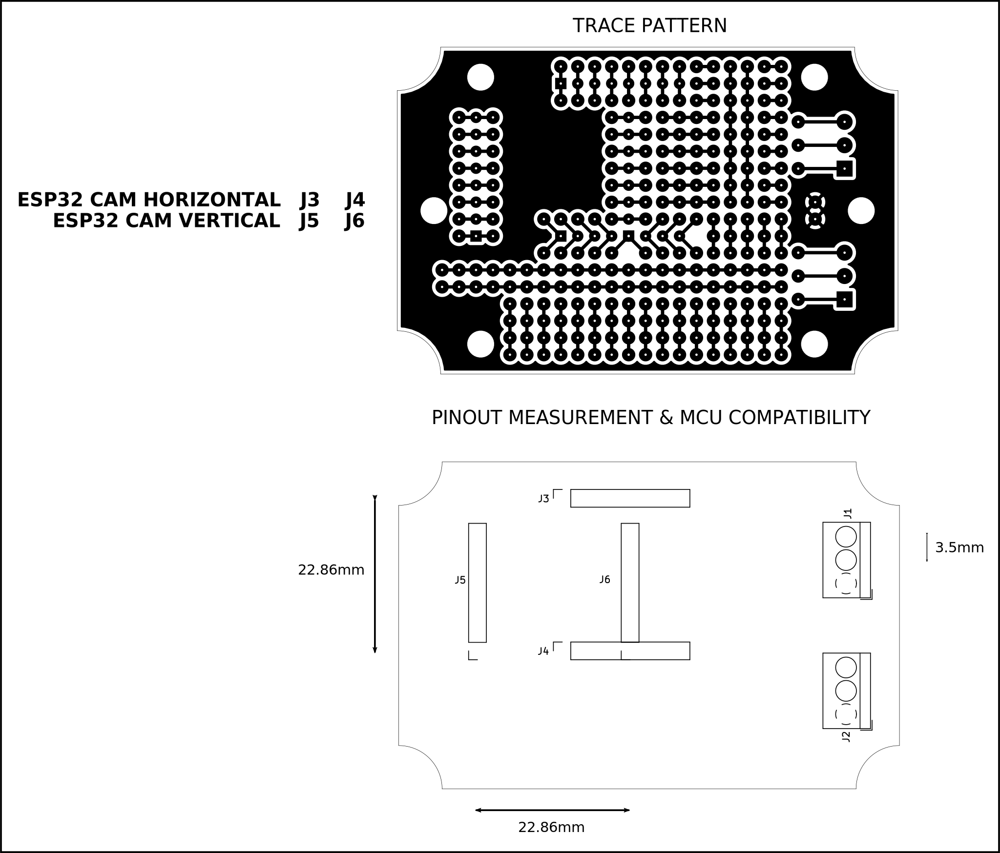
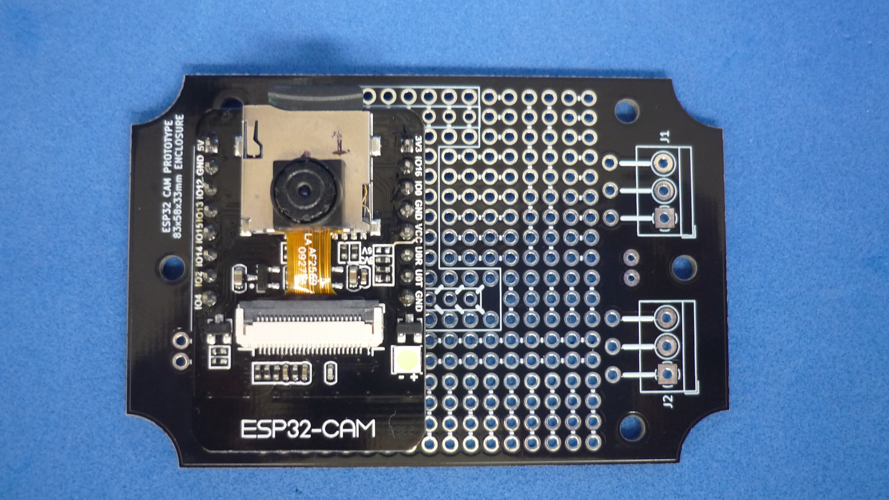
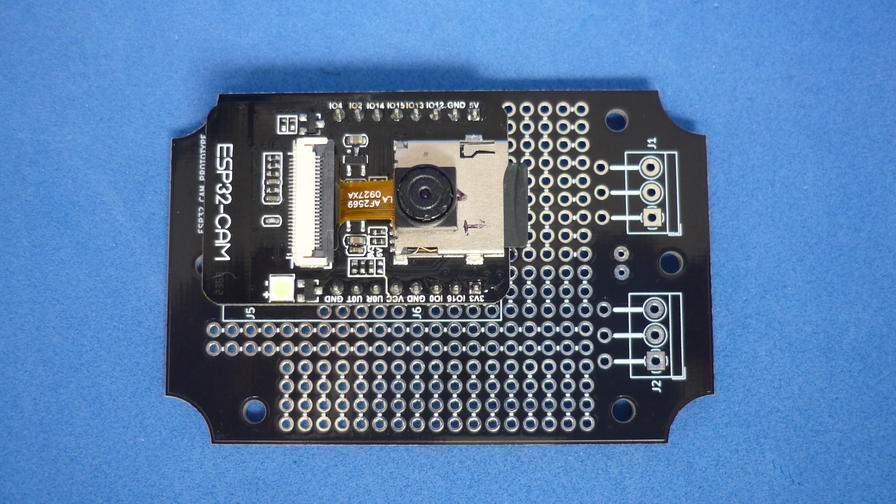

# ESP32-CAM HOST BOARD THAT FITS INSIDE 83x58mm WATERPROOF HOUSING

The board is designed to fit inside a generic 83x58mm waterproof enclosure. 

## How to use this repository

The PCB was developed in KiCad V5.1,

## Directory structure

* The root folder contains template KiCad files: project, schematic and PCB 
* /modules folder contains additional footprints needed to edit printed circuit board
* /gerber folder contains ready to manufacture files.
* /assets folder contains support files for reade.md

## PCB layout

## Vertical

The module could be placed vertically to maximize square shaped free area, for additional modules, LiPo batteries, etc.

## Horizontal

The board also could be placed horizontally to make room for a cylindrical battery cell.

Image sensor is placed in the area designed for camera lenses

On the back of the PCB there is enough free space for a bigger battery or additional electronics.

Panelized PCB version 

