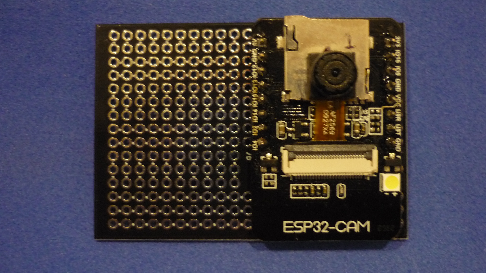

# ESP32-CAM HOST BOARD THAT FITS INSIDE WATERPROOF SPORTSCAM HOUSING

The board is designed to fits inside a generic waterproof enclosure compatible with cameras like Go Pro hero 3, SJCAM SJ400, etc. 

Here is the layout of the PCB.

The module could be placed vertical to maximize square shaped free area, for additional modules, lipo batteries, etc. There is no room for the SD card in this configuration.

The board also could be placed horizontal to make room for a cylindrical battery cell.

