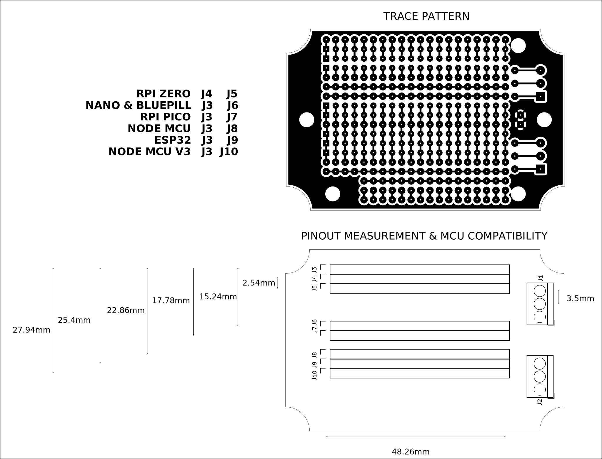

# PROTOTYPE BOARD FOR MCU MODULES AND FITS INSIDE 83x58mm WATERPROOF HOUSING

This board can host MCU modules up to 20 pin per row in a double row configuration. The minimun separation between rows is 2.54 mm and the maximun separation between rows is 27.94 mm, so most common types of MCU modules are supported. The board is designed to fit inside a generic 83x58mm waterproof enclosure. 

## How to use this repository

The PCB was developed in KiCad V5.1,

## Directory structure

* The root folder contains template KiCad files: project, schematic and PCB 
* /library folder contains additional symbols needed to edit printed schematic
* /modules folder contains additional footprints needed to edit printed circuit board
* /gerber folder contains ready to manufacture files.
* /assets folder contains support files for reade.md

## PCB layout

## Back

The stamp style module is placed on the back of the card.

## Front

All of the pins of the module are routed to pcb pads, also, space for 2 AA size battery holder. There are also some traces for breadboarding

Module soldered on the back

Female headers used for debugging or adding a "hat" card with additional electronics.

Panelized PCB version 

