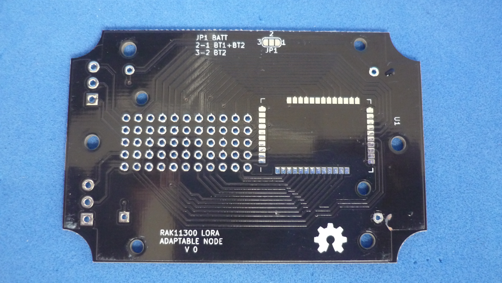
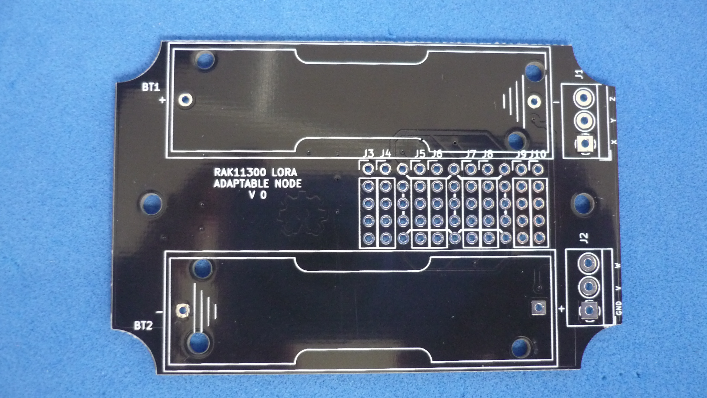

# RAK11300 BREAKOUT BOARD THAT FITS INSIDE 83x58mm WATERPROOF HOUSING

The board is designed to fit inside a generic 83x58mm waterproof enclosure. 

## How to use this repository

The PCB was developed in KiCad V5.1,

## Directory structure

* The root folder contains template KiCad files: project, schematic and PCB 
* /library folder contains additional symbols needed to edit printed schematic
* /modules folder contains additional footprints needed to edit printed circuit board
* /gerber folder contains ready to manufacture files.
* /assets folder contains support files for reade.md

## PCB layout

## Back

The stamp sytle module is placed on the back of the card.

## Front

All of the pins of the module are routed to pcb pads, also, space for 2 AA size battery holder .

Image sensor sees through the transparent enclosure

Female headers used to raise the image sensor as close to the case as possible. There is now some free space for additional electronics.

Panelized PCB version 

