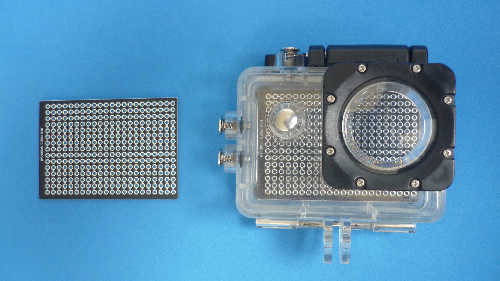
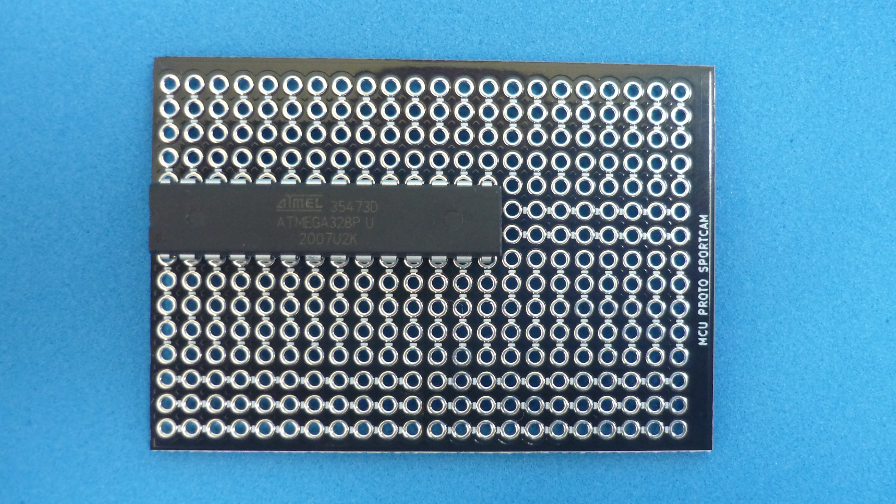
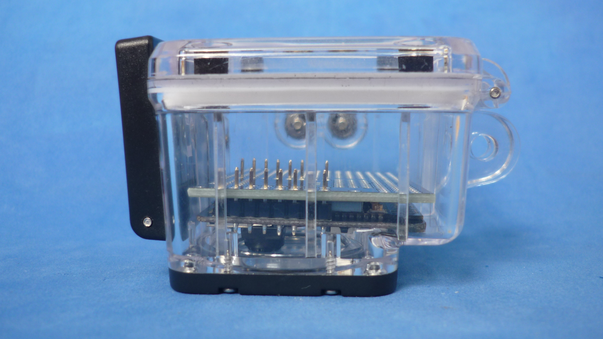
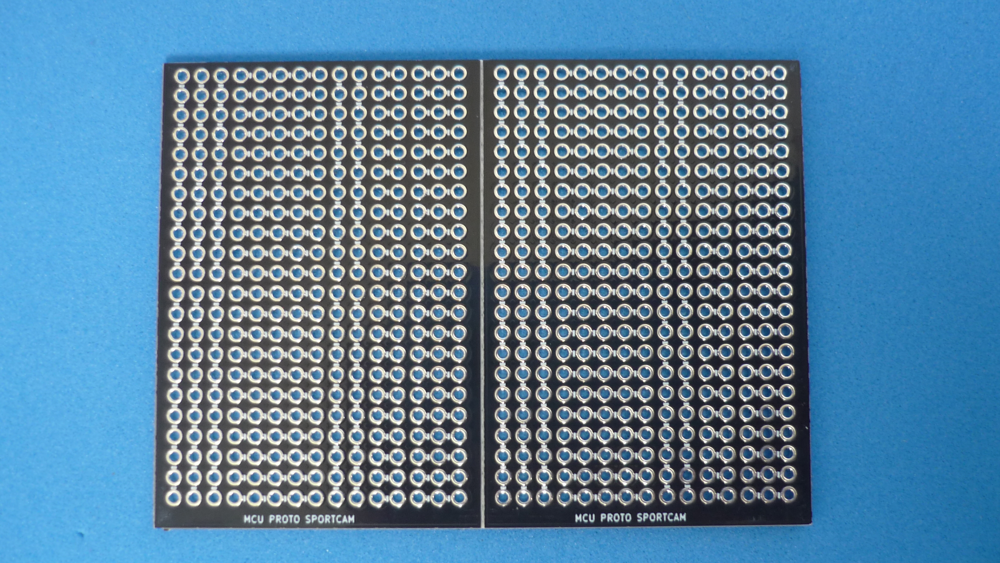

# MCU HOST BOARD THAT FITS INSIDE WATERPROOF SPORTSCAM HOUSING

The board can host MCU modules up to 20 pins per row in a double row configuration.is designed to fit inside a generic waterproof enclosure compatible with cameras like Go Pro hero 3, SJCAM SJ400, etc. 

## How to use this repository

The PCB was developed in KiCad V5.1,

## Directory structure

* The root folder contains template KiCad files: project, schematic and PCB 
* /modules folder contains additional footprints needed to edit printed circuit board
* /gerber folder contains ready to manufacture files.
* /assets folder contains support files for reade.md

## PCB layout

## DIP IC

Dual in-line package chip placed with 7.62 mm separation between pin rows

## SMALL MODULE

An example showing an Arduino nano with 15.24 mm separation between header rows

## BIG MODULE

An example showing a NODE MCU V3 with 27.94 mm separation between header rows.

On the back of the PCB there is enough free space for a bigger battery or additional electronics.

Panelized PCB version 

